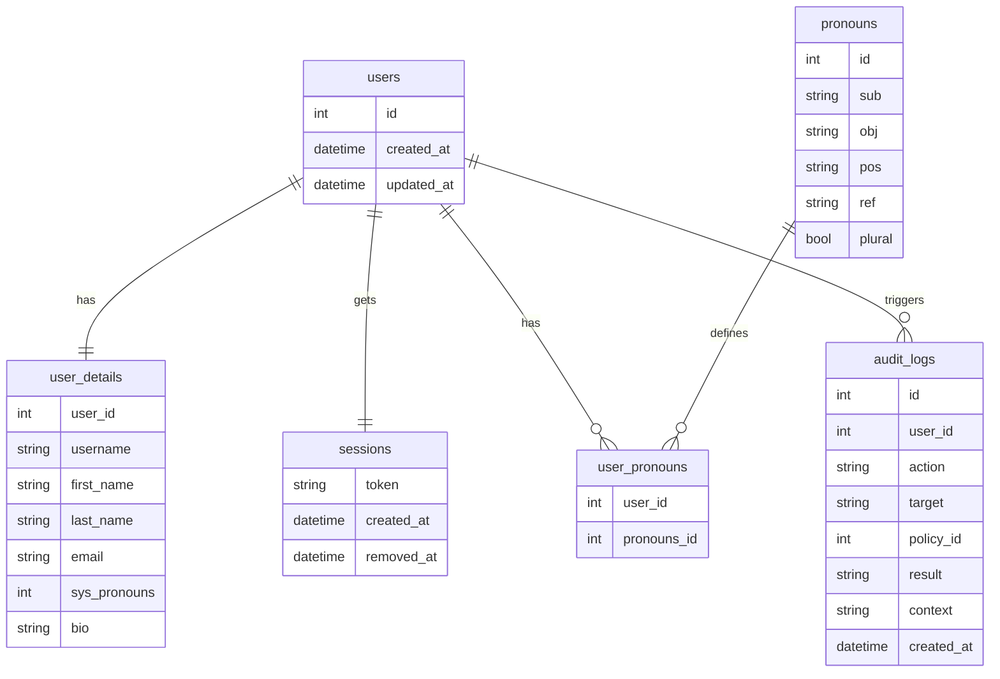
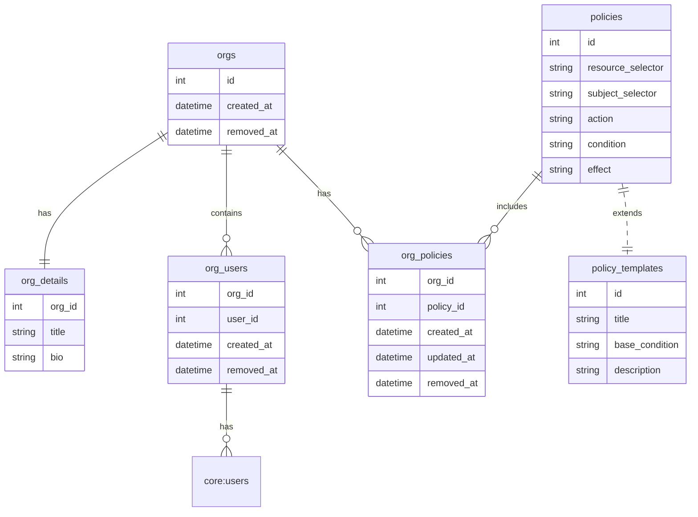
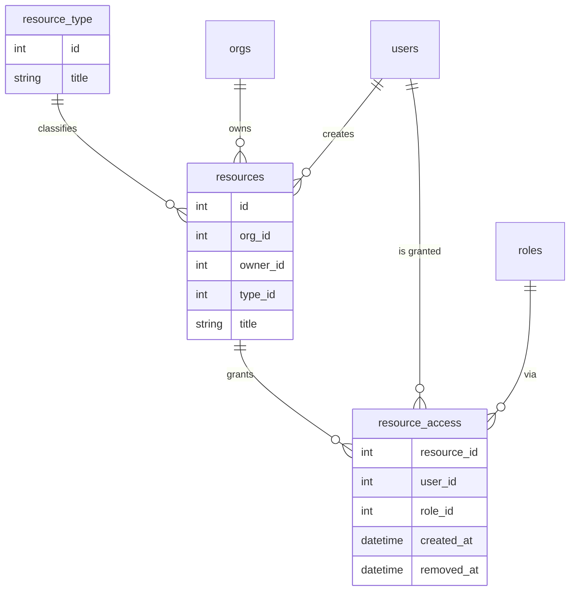
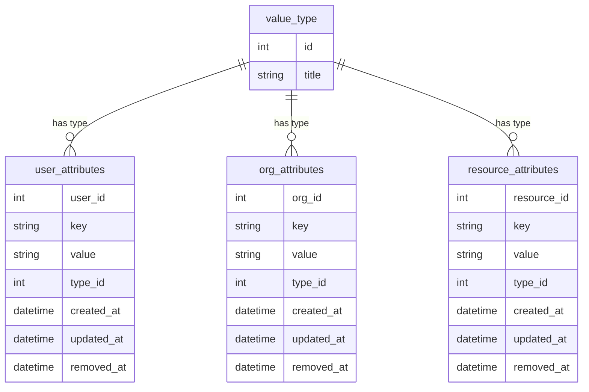
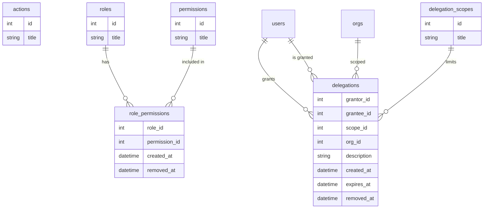
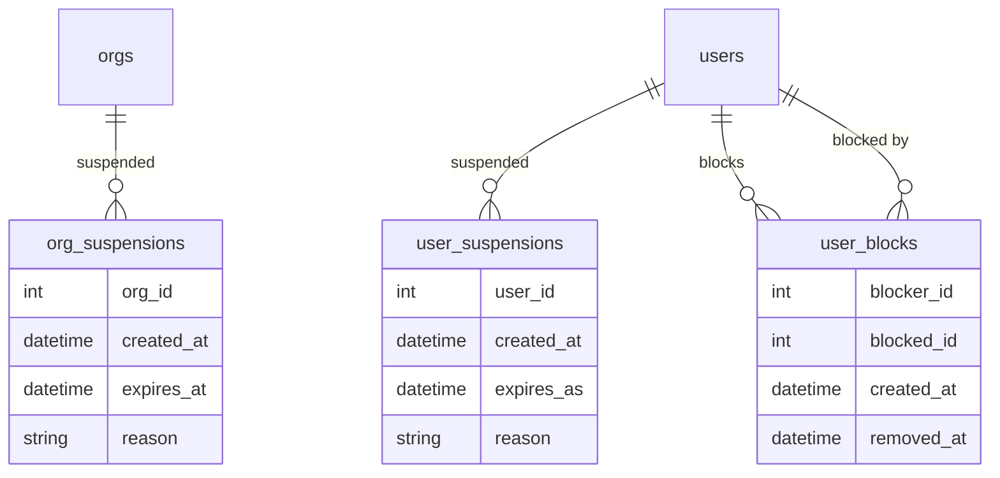

## Core

## Orgs

## Resources

## Attributes

## Auth

## Moderation

<!--
## Mermaid Reference
**Diagram Type:** `erDiagram` (Entity Relationship Diagram)
| Symbol      | Relationship       |   | Syntax           | Usage             |
| ----------- | ------------------ | - | ---------------- | ----------------- |
| `\|\|`      | exactly one        |   | `%%`             | Comment           |
| `o{` / `}o` | zero or more       |   | `ITEM { ... }`   | Model Definition  |
| `\|{`       | one or more        |   | `TYPE KEY_NAME`  | Attribute Def.    |
| `--`        | generic connection |   | `A -- B : LABEL` | Relationship Def. |
-->