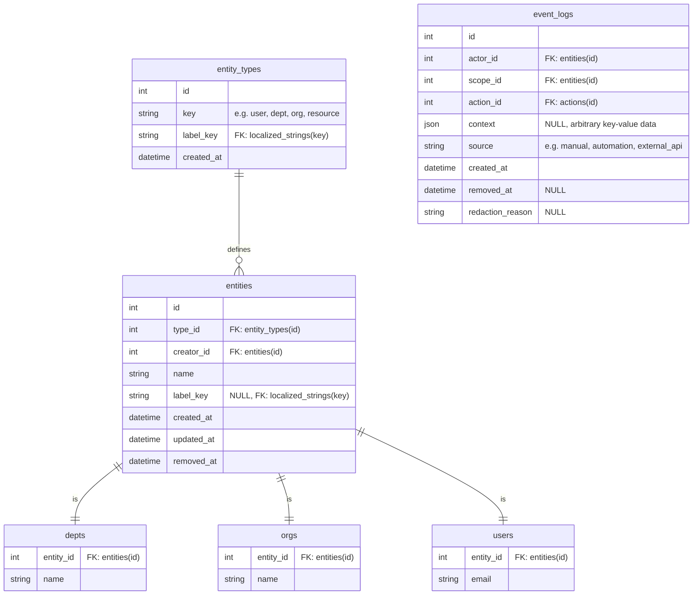
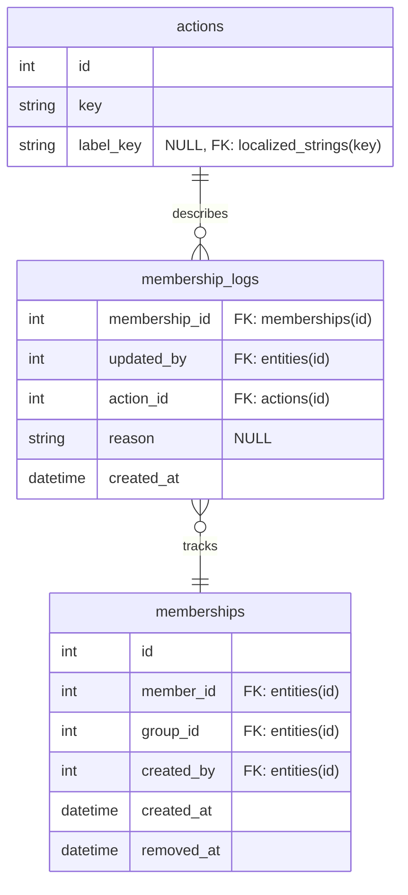
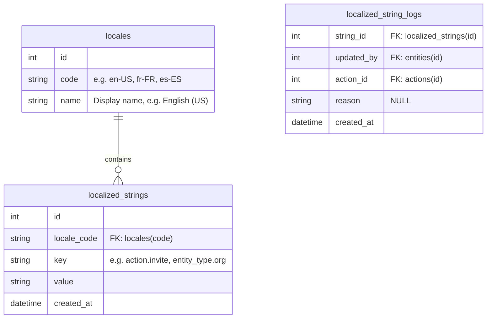
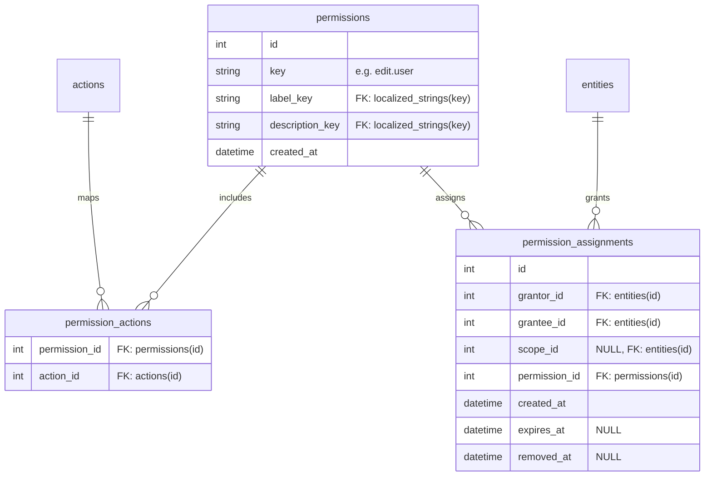

# Schema Design
## 0. Important Context
1. Fields are `NOT NULL` unless declared otherwise.
    1. All `removed_at` fields are `NULL`able, always.
2. If `id` is present, it is the primary key unless otherwise stated.
3. Foreign keys are shown inline as `"FK: ..."` in field descriptions.
4. Tables with `key` and `label` fields account for localization.

### 0.1 Terms
- **group** - any entity which may contain other entities (e.g. `orgs`, `depts`)

## 1. Core Domain
### 1.1 Tables

### 1.2 Constraints
1. `UNIQUE(type_id, name)` on `entities`
2. `UNIQUE(key)` on `entity_types`

### 1.3 Indexes
1. `(type_id, id)` on `entities`
2. `creator_id` on `entities`
3. `name` on `entities`
4. `(actor_id, created_at)` on `event_logs`
5. `(scope_id, created_at)` on `event_logs`
6. `action_id` on `event_logs`
7. `created_at` on `event_logs`

## 2. Structure Domain
### 2.1 Tables

### 2.2 Constraints
1. `UNIQUE(key)` on `actions`
2. `UNIQUE(member_id, group_id, removed_at)` on `memberships`

### 2.3 Indexes
1. `created_by` on `memberships`
2. `group_id` on `memberships`
3. `member_id` on `memberships`
4. `removed_at` on `memberships`
5. `(member_id, group_id, removed_at)` on `memberships`
6. `created_at` on `membership_logs`
7. `membership_id` on `membership_logs`

## 3. Locale Domain
### 3.1 Tables

### 3.2 Constraints
1. `UNIQUE(code)` on `locales`
2. `UNIQUE(key, locale_code)` on `localized_strings`

### 3.3 Indexes
1. `code` on `locales`
2. `(key, locale_code)` on `localized_strings`
3. `locale_code` on `localized_strings`
4. `key` on `localized_strings`
5. `string_id` on `localized_string_logs`

## 4. Auth Domain
### 4.1 Tables

### 4.2 Constraints
1. `UNIQUE(key)` on `permissions`
2. `UNIQUE(permission_id, action_id)` on `permission_actions`

### 4.3 Indexes
1. `key` on `permissions`
2. `(permission_id, action_id)` on `permission_actions`
3. `action_id` on `permission_actions`